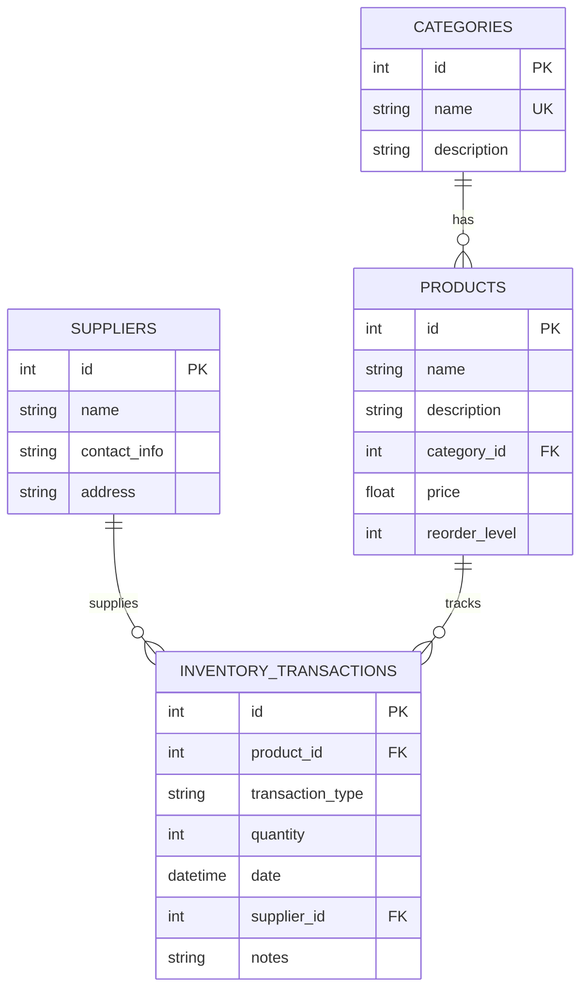
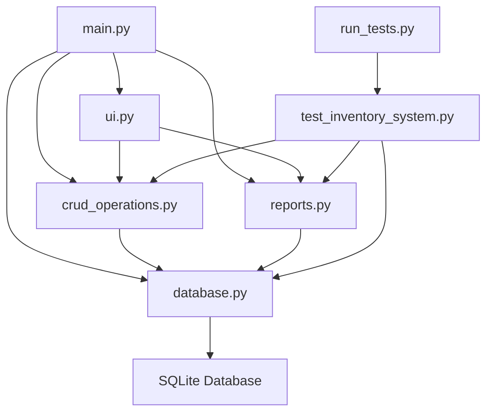

# Inventory Management System

**CSE 310 - Applied Programming - Module 6**  
**SQL Relational Databases Project**

**Author:** Ether-G  
**Date:** 07/19/2025 
https://www.youtube.com/watch?v=rf3BKcg2_2E
## Overview

Inventory management system built with Python and SQLite demonstrating database concepts including CRUD operations, relational design, SQL joins, aggregate functions, and date/time operations.

## Features

- SQLite database with multiple related tables
- Full CRUD operations for all entities
- Command line interface with menu system
- Inventory reports and analytics
- Data validation and error handling
- Comprehensive unit test suite

## Technology Stack

- Python 3.7+
- SQLite3
- tabulate
- colorama

## Installation

### Prerequisites
- Python 3.7 or higher
- pip

### Setup

1. Clone the repository
2. Create virtual environment:
   ```bash
   python3 -m venv venv
   source venv/bin/activate
   ```
3. Install dependencies:
   ```bash
   pip install -r requirements.txt
   ```
4. Run the application:
   ```bash
   python3 main.py
   ```

## Usage

The system provides a menu-driven interface for:
- Managing products, categories, suppliers
- Processing inventory transactions
- Generating reports and analytics
- Searching products

## Testing

Run the comprehensive test suite:
```bash
python3 run_tests.py
```

Run with coverage:
```bash
python3 run_tests.py -c
```

## Database Schema



## System Architecture



## File Structure

```
inventory-management-system/
├── main.py              # Application entry point
├── database.py          # Database operations
├── crud_operations.py   # CRUD operations
├── reports.py           # Report generation
├── ui.py               # User interface
├── test_inventory_system.py  # Unit tests
├── run_tests.py        # Test runner
├── requirements.txt    # Dependencies
├── README.md          # Documentation
└── inventory.db       # SQLite database
```

## SQL Schema

```sql
-- Categories table
CREATE TABLE categories (
    id INTEGER PRIMARY KEY AUTOINCREMENT,
    name TEXT NOT NULL UNIQUE,
    description TEXT
);

-- Suppliers table
CREATE TABLE suppliers (
    id INTEGER PRIMARY KEY AUTOINCREMENT,
    name TEXT NOT NULL,
    contact_info TEXT,
    address TEXT
);

-- Products table
CREATE TABLE products (
    id INTEGER PRIMARY KEY AUTOINCREMENT,
    name TEXT NOT NULL,
    description TEXT,
    category_id INTEGER,
    price REAL NOT NULL,
    reorder_level INTEGER DEFAULT 10,
    FOREIGN KEY (category_id) REFERENCES categories (id)
);

-- Inventory transactions table
CREATE TABLE inventory_transactions (
    id INTEGER PRIMARY KEY AUTOINCREMENT,
    product_id INTEGER NOT NULL,
    transaction_type TEXT NOT NULL CHECK (transaction_type IN ('IN', 'OUT', 'ADJUSTMENT')),
    quantity INTEGER NOT NULL,
    date TIMESTAMP DEFAULT CURRENT_TIMESTAMP,
    supplier_id INTEGER,
    notes TEXT,
    FOREIGN KEY (product_id) REFERENCES products (id),
    FOREIGN KEY (supplier_id) REFERENCES suppliers (id)
);
```

## Key Features

### SQL Features
- Complex joins across multiple tables
- Aggregate functions for analytics
- Date/time operations for reporting
- Foreign key constraints for data integrity
- Check constraints for validation

### Reports
- Current inventory levels
- Low stock alerts
- Inventory value calculations
- Transaction history
- Category and supplier analysis
- Monthly summaries

### Data Validation
- Foreign key constraint enforcement
- Unique constraint validation
- Transaction type validation
- Input sanitization

## File Structure

```
inventory-management-system/
├── main.py              # Main application entry point
├── database.py          # Database initialization and core operations
├── crud_operations.py   # CRUD operations for all entities
├── reports.py           # Report generation and analytics
├── ui.py               # User interface and menu system
├── requirements.txt    # Python dependencies
├── README.md          # This file
└── inventory.db       # SQLite database (created automatically)
```

## Module Requirements

- SQL Relational Databases - Complete implementation
- Multiple Related Tables - 4 interconnected tables
- Full CRUD Operations - Create, Read, Update, Delete for all entities
- Command Line Interface - Menu-driven interface
- Inventory Reports - Comprehensive reporting system
- Stretch Challenges - Advanced SQL features implemented

## License

MIT License

Copyright (c) 2025 Ether-G

Permission is hereby granted, free of charge, to any person obtaining a copy
of this software and associated documentation files (the "Software"), to deal
in the Software without restriction, including without limitation the rights
to use, copy, modify, merge, publish, distribute, sublicense, and/or sell
copies of the Software, and to permit persons to whom the Software is
furnished to do so, subject to the following conditions:

The above copyright notice and this permission notice shall be included in all
copies or substantial portions of the Software.

THE SOFTWARE IS PROVIDED "AS IS", WITHOUT WARRANTY OF ANY KIND, EXPRESS OR
IMPLIED, INCLUDING BUT NOT LIMITED TO THE WARRANTIES OF MERCHANTABILITY,
FITNESS FOR A PARTICULAR PURPOSE AND NONINFRINGEMENT. IN NO EVENT SHALL THE
AUTHORS OR COPYRIGHT HOLDERS BE LIABLE FOR ANY CLAIM, DAMAGES OR OTHER
LIABILITY, WHETHER IN AN ACTION OF CONTRACT, TORT OR OTHERWISE, ARISING FROM,
OUT OF OR IN CONNECTION WITH THE SOFTWARE OR THE USE OR OTHER DEALINGS IN THE
SOFTWARE. 
